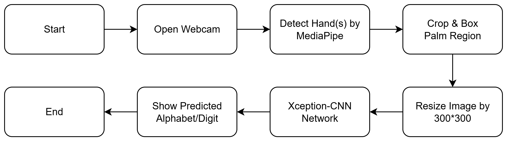

# Lightweight-Deep-Learning-Based-Framework-for-Bangla-Sign-Language-Detection-and-Recognition

The framework covers both Bangla Static One-Hand, Static Two-Hands, Words and Sentences Gestures defining full modality. Exclusive real time augmentation in Xception-CNN, Unique feature extraction of Bi-LSTM provided very good accuracy which is rare in Bangla Sign Language studies.
---
The datasets used for this work is below with statistics:

The models used corresponding to the datasets are:

---

##Xception-CNN (BdSL49)

**Dataset Preprocessing:**
Two initial folders → Detection & Recognition
Recognition folder → Cropped palm region
Finally 49 classes with cropped hand signs

**Data Augmentation:**
image size → 300*300
batch size → 32
min-max scaling on pixels
30% rotation and zoom
20% width and height shift and brightness change

**Transfer Learning:**
Xception has total 71 layers
Freeze first 50 layers for
       better edge detection
 Rest of the layers trainable

**Class mapping Overview**
0	০
1	১
2	২
3	৩
4	৪
5	৫
6	৬
7	৭
8	৮
9	৯
10	ড
11	ঢ
12	ঞ
13	ড়
14	ট
15	ঠ (till 48)

**Model Training:**
Dropout → 0.3, 256 neurons
Dense Layer, Softmax activation function

**Training Statistics:**
21.4 million parameters
Early Stopping, patience = 5
64% Train, 16% Validation Set
20% Test Set
46 epochs needed (each 5-6 minutes)
saved model as .keras ( 230.86 MB)

---

##MLP (BDSL47)

**Data Preprocessing**
Merged alphabets and digits from 10 users to one directory
Finally 47 classes with corresponding sign gestured images 

**Feature Engineering**
21 * 3D = 63 landmarks extracted from each image
1 output feature of class labels
Landmarks extracted from MediaPipe hand landmarks
Finally csv file with 64 features 

**Class mapping overview**
0	অ/য়
1	আ
2	ই/ঈ
3	উ/ঊ
4	র/ঋ/ড়/ঢ়
5	এ
6	ঐ
7	ও
8	ঔ
9	ক
10	খ/ক্ষ
11	গ
12	ঘ
13	ঙ
14	চ
15	ছ (till 46)

**Model Training**
cross-validation, k = 5
StandardScaling
5 custom Dense layers

**Dense Layer Details:**
1st and 2nd layers have 128 nodes each
Batch Normalization and LeakyRelu activation function to all layers
3rd and 4th layers have 64 and 32 nodes 
Dropout 0.33 and 0.25 respectively in 3rd and 4th layer
Final layer has 47 nodes with activation 
function → softmax

**Training Statistics:**
Adam optimizer with learning rate 0.001
Batch size = 64
Early Stopping, patience → 30
37,999 parameters 
model size → 510 KB

---

##Bi-LSTM (DU Dataset)

The dataset was collected from DU and uploaded on kaggle: https://www.kaggle.com/datasets/hassan0008jhh/video-dataset

Each videos were 4 seconds, middle 2 seconds provided more information as first and last second was more often wasted for starting and ending the gesture. Also Eucledian distance between nose and left & right wrists to track the temporal position of the hands as same palm gesture at different positions relative to body often meant different words and sentences.

**Feature Engineering:**
 
Middle 2 seconds → 60 frames
For each frame ->
            21 * 3D or 63 hand landmarks * 2 hands → 126 landmarks
            Euclidean Distance between left wrist to nose
            Euclidean Distance between right wrist to nose
Total 126 + 2 → 128 features
Finally Numpy Array of 128 features per frame

**Final Dataset Architecure:**

**Model Training:**
Load the numpy arrays with class label in a list
Label Encoding is used for class names
Standard Scalling is used on arrays
Neural network with 4 custom layers

**Custom Layer Details:**
1st and 2nd layers are Bidirectional LSTM layers with 64 nodes
Dropout 0.3 and BatchNormalization
3rd layer is Dense with 64 nodes
Finally output Dense layer with softmax activation function

**Training Statistics:**
Adam optimizer with learning rate 0.0005
Batch size = 64
Early Stopping, patience → 30
210 thousand parameters 
model size → 2.47MB

---

##Model Pipelines

**Xception-CNN pipeline**

**MLP pipeline**

**Bi-LSTM pipeline**

**Final combined framework**

